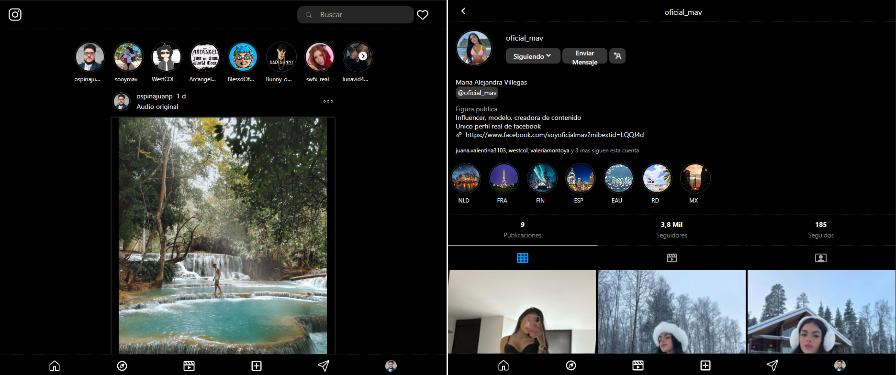

# Proyecto Clon de Instagram

¡Bienvenido/a a nuestro proyecto!

## Descripción

Este proyecto es un clon de Instagram que busca replicar algunas de las funcionalidades básicas de la popular red social. Actualmente, hemos implementado las páginas de inicio (home) y perfil (profile). 

### La página de Home incluye 
- la sección de historias  
- la sección de feed de publicaciones

###  La página de Profile incluye 
- la sección visual de Perfil (foto, username, siguiendo, mensaje)
- la sección visual de Información (nombre, thread, descripción, url, seguidores)
- la sección visual de Destacados
- la sección visual de Estadísticas
- la sección navegación Publicaciones - Reels - Tag

## Tecnologías Utilizadas

- HTML
- CSS
- JavaScript
- React

## Herramientas Utilizadas

- Sistema Operativo: Ubuntu y Windows Subsystem for Linux (WSL)

## Empaquetador

Utilizamos Vite como empaquetador para el desarrollo y construcción del proyecto.

## Librerías

- Icon React: Para la gestión de iconos en la interfaz de usuario.

## Instalación

1. Clona el repositorio a tu máquina local.
2. Ejecuta `pnpm install` o `npm install` para instalar las dependencias.
3. Utiliza `pnpm start` o `npm start` para iniciar el servidor de desarrollo y visualizar el proyecto.
4. Para construir el proyecto, ejecuta `pnpm build` o `npm build`.
5. Si deseas visualizar una versión previa del proyecto en un entorno de preproducción, ejecuta `pnpm preview` o `npm preview`.

## Archivo Principal

El archivo principal del proyecto es `App.jsx`, donde se encuentra la estructura principal de la aplicación.

## Contribución

¡Estamos abiertos a contribuciones! Si deseas participar en el desarrollo de este proyecto, por favor sigue los siguientes pasos:

1. Haz un fork del repositorio.
2. Realiza tus cambios en una nueva rama (`git checkout -b feature/nueva-funcionalidad`).
3. Realiza un commit de tus cambios (`git commit -am 'Agrega nueva funcionalidad'`).
4. Haz push a la rama (`git push origin feature/nueva-funcionalidad`).
5. Envía un pull request.

## Diario de Desarrollo

En esta sección, documentaré mi progreso y desafíos mientras desarrollo este proyecto de clon de Instagram.

**Fecha: 08/03/2024:** 
- Comencé el proyecto clon de Instagram y configuré el entorno de desarrollo con Vite y React.
- Agregue mi proyecto de resect CSS con el fin de inicializar con mi estilos sin afectación.
- Agregue la estructura principal de carpetas a mi proyecto y añadí mi menu inferior con el cual inicie en el proyecto.
- Enfrente mi primer problema con las imágenes teniendo conocimiento en la manipulación de ellas se empezó a dificultar para que se adaptara el tamaño del padre.
- Reorganice la estructura de mi archivos para que estén ubicados mas adecuadamente.
- Añadí el componente header al colocar este componente me toco ajustar el css para los componentes de profile y header en si.
- Añadí el componente de infoprofile y me toco modificar el profile y editar en el header el menu superior.
- Añadí el componente photo para la info profile y me toco modificar este contender para que pueda usar este.

**Fecha: 09/03/2024:** 
- Al terminar el apartado de info profile pase al highlightedsave el cual no sabia por donde abordarlo ya que este tipo de slider no los había trabajado antes entonces me puse y en este momento identifique que el componente de photo lo iba a reutilizar varias veces y aquí nuevamente me tuve dificultades con la imagen para que no se desbordara del contenedor padre y poder que fuera genérico sin importar donde lo usara.
- Añadí la sección de stat realmente fue muy básica no presente mucho problema mas que todo era de tamaño adaptativo, me di cuenta que mi desarrollado de este proyecto solo para dispositivos menores a 935px, esto habrá que validarlo mas adelante. tomare la decision de trabajar de aquí en adelante para dispositivos menores a esta resolución luego me enfocare al responsive.
- Realice mas correcciones de css a mi componente de photo.
- Genero mi tablist para poder tener el menu de navegación para publicaciones reels y tags.
- Agregue un estado para saber en cual tab esta posicionado y asi poder saber que mostrar mas adelante ademas de aplicar ciertos diseños específicos en el tab seleccionado.
- tuve problemas con el tamaño de mi screen entonces modifique mis width en los diferentes componentes, tome la edición de que tengo un width mínimo de 380px y un máximo de 935px para mi pagina de profile, tomando como referencia la pagina original.

**Fecha: 10/03/2024:** 
- Cambio el componente de photo ya que considero que requiero reorganizarlo y colocarlo mucho mas genérico por esta razón lo llamo Userthmbnail.
- Agrego mi PostProfile y con esto me doy cuenta que tengo algunos bug de css y varios componentes y empiezo a corregirlos son mas de tipo visual, paddins margin o incluso algunos width con el tipo de tamaño usado.
- al tener todos los componente y aspecto visual con información statica, empiezo a modificar y generar un json simulando la captura de datos de una api para poder utilizar toda la información requerida.
- corrijo algunos style ya que no "controlo" la información que llega de la API, esto con el fin de simular mas un ambiente productivo o de consumo de datos.
- Agregue la pagina de Home entonces cambio el route de mi app para que no me muestre mas el profile y poder empezar a desarrollar mi otra pagina.
- Agregue y desarrolle mi menu superior.
- Agregue mi contenedor de contenido de mi pag y también volví a llamar mi menu inferior ya que es el mismo.
- Agregue mi segmento para la story pero me di cuenta que es el mismo componente de higlightedsave entonces tomare la edición de reutilizarlo para poder reutilizar mas mis componentes.
- Me toco agregar otros elementos adiccionales a este componente para poder tener los botoner para poder desplazarme lateralmente, con esto me di cuenta que tengo que usar ademas de useState useEffect para poder manipular el desplazamiento.

**Fecha: 11/03/2024:** 
- Corrigo algunos estilos mas orientados a contenedores y a posicionamiento en la pagina.
- Agregue mi componente de publication el cual sera el elemento que mostrara el contenido en el feed, en este momento esta diseñado para que contenga una imagen.
- Agregue mi componente feed en cual traerá la información de todas las publicaciones e implemente el scroll infinito, tuve muchos problemas utilice herramientas web pero aun me falta comprendedlo por completo ya que unas utilidades de windows no se muy bien como funcionan.
- Organice algunos estilos que eran cursor pointer y no los tenian.
- Actualizo mi readme para tener un proyecto un poco mas actualizado y entendible.
- Creo e identifico mi roadmap que deseo utilizar en mi proyecto.
- Agrego mas importación de lo que llevo en mi proyecto para dar un mejor entendimiento de lo desarrollado.
- Creo mi Diario de desarrollo y me pongo al dia.

## Roadmap

El siguiente es el plan de desarrollo previsto para el proyecto. Por favor, ten en cuenta que estos pasos pueden sufrir cambios a medida que avanzamos en el desarrollo:

1. Generar JSON para alimentar el feed y los perfiles de usuario.
2. Implementar enrutamiento para una navegación más fluida.
3. Permitir la navegación al perfil del usuario propio desde cualquier lugar de la aplicación.
4. Habilitar la navegación desde las publicaciones del feed al perfil del usuario correspondiente.
5. Facilitar la navegación desde las historias de los usuarios al perfil respectivo.
6. Optimizar la interfaz para que sea completamente receptiva en pantallas de escritorio para la visualización del perfil.
7. Mejorar la experiencia de usuario en pantallas de escritorio para una visualización óptima del feed.

Recuerda que estos pasos están sujetos a ajustes y modificaciones a medida que avanza el desarrollo del proyecto.

## Contacto

Si tienes alguna pregunta o sugerencia sobre el proyecto, no dudes en ponerte en contacto con nosotros.

## Licencia

Este proyecto está bajo la Licencia [MIT](LICENSE).
